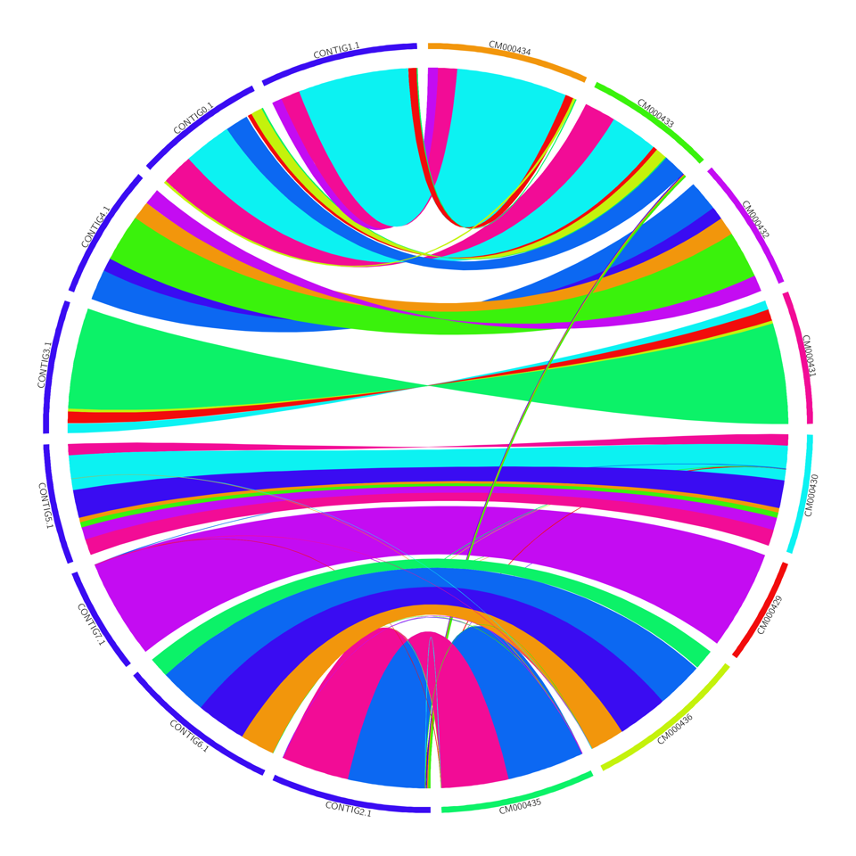

# Nucmer.2.circos.pl

A simple-ish perl script that takes output from nucmer or promer in the mummer package and creates
input files that should make reasonable pretty circos 'ribbon' plots of the similarity hits.

usage is: perl Nucmer.2.circos.pl [options] <deltafile>

This script might/should/sometimes writes all the input files circos needs, but doesn't actually RUN circos. After running this, you will have a circos.conf and karyotype.txt and links.txt (maybe more) files in this folder. Then run circos to generate circos.png and circos.svg output files. This isn't just lazy - you might want to change circos parameters!

quite a lot of options to filter hits and control the circos output. With a bit of patience you can make reasonably pretty output like this:

INPUT OPTIONS:

	--coord-file	pass a coordinate file. I assume its -dtlro format - i.e. 13 columns
	--promer	deltafile is from promer - expect extra columns!
	--parse_contig_names	by default, I try and keep the contig ID passed to circos the same as the ID in the input files.. but if you have special characters (e.g. ':') this upsets circos. Use this flag! - your printed names will be consistent, but your circos files won't use these, so it will  be harder to make sense of them / modify thing downstream of this script. Might make this default at some point in future..
	--query_contigs_to_keep	by default, I keep all contigs that have links. If this is a filename, read this and just keep these
	--ref_contigs_to_keep	by default, I keep all contigs that have links. If this is a filename, read this and just keep these

DISPLAY/OUTPUT OPTIONS:

	--min_hit_len=1000	length of smallest hit (passed to show-coords with -L flag)
	--min_chr_len=1000	length of smallest contig/scaffold/chromosome to include
	--min_query_chr_len=1000	length of smallest QUERY contig/scaffold/chromosome to include (overrides min_chr_len)
	--min_ref_chr_len=1000	length of smallest REF contig/scaffold/chromosome to include (overrides min_chr_len)
	--ribbons	use ribbons rather than thin links
	--gradual_shading=i	experimental feature! - use i different colour intensities along scaffolds (default = 1)
	--col_start_s=f	start 'saturation' level for gradual shading - also used as fixed value without gradual_shading (default 0.2 with gradual_shading, 0.95 without)
	--col_end_s=f	end 'saturation' level for gradual shading - default 1, ignored otherwise
	--col_start_v=f	start 'value' level for gradual shading, or fixed value without gradual shading - default 0.6
	--col_end_v=f	end 'value' level for gradual shading - default 0.9
	--col_start_h=f	start 'hue' level for colour picker
	--colour_links_by_query	links have a different colour for each query scaffold.. default is for reference scaffold
	--colour_rainbow_links=i	colour each link differently, as possible with i colours
	--ref_order=file	either a text file with identifiers in the order you want them to appear, or a fasta file with identifiers in the order you want them, otherwise sorted alphabetically, or relative to the query order (to try and minimise crossing - 'rel'; 'rel' is number of links, 'relw' is total length of links - probably better)
	--query_order=file	as above, but for query scaffolds
	--flipquery	flip query scaffolds so ribbons are untwisted etc. (default=yes, unless flipreference is used. To disable, use --noflipquery)
	--flipreference	flip reference scaffolds so ribbons are untwisted etc. (default=no, to disable, use --noflipquery)
	--prefix=string	add this string to all output files
	--zoom_query=f	zoom query karyotype by this factor

LABELLING OPTIONS:

	--no_query_labels	don't show labels for query chromosomes
	--no_ref_labels	don't show  labels for ref chromosomes
	--label_size=s	set size of labels. Include UNITS - i.e. 24p, not just 24 (default)

MISCELLANEOUS OPTIONS:

	--help|-h|-?	print this      --debug	print some debugging information

